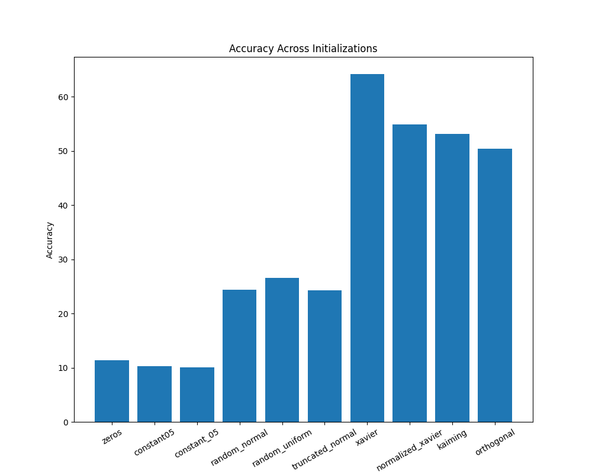

# RNN and LSTM weight's initialization

The aim of this project has been to explore in depth the effects of different initialization strategies performance of Recurrent Neural Networks (RNNs) and Long Short-Term Memory (LSTM) networks. The divergence in these effects often arise from inherent challenges such as vanishing and exploding gradients, sluggish convergence rates, among others. 

We will explore various initialization strategies, such as:
- Zero
- Constant
- Random Uniform
- Random Normal
- Truncated
- Xavier
- Normalized Xavier
- Kaiming
- Orthogonal 

## Brief problem discussion

The vanishing and exploding gradient issues, poor convergence, and symmetry breaking are critical challenges in training Recurrent Neural Networks (RNNs) and LSTM, significantly influenced by the choice of weight initialization strategies.

#### - Vanishing gradients

This specific issue can become more prevalent if the initial weights are too small, leading to gradients that diminish too quickly as they are propagated back through time, thereby slowing down or halting the learning process.

#### - Exploding gradients

On the other hand, exploding gradients are more likely to occur if the initial weights are too large, causing gradients to grow exponentially during backpropagation and potentially leading to numerical instability or divergence of the model parameters.

#### - Slow convergence
    
Bad weight initialization can lead to a situation where the optimization algorithm struggles to find a good direction to minimize the loss function, resulting in slow convergence or convergence to suboptimal minima.

#### - Symmetry Breaking Problems
    
In RNNs, particularly when all weights are initialized to the same value, neurons can end up learning the same features during training. This lack of diversity in the learning process can significantly impede the network's capacity to capture complex patterns in the data.

## Initialization strategies on LSTM model

#### Data (/data):  
We have decided to work with the 2018 MAESTRO dataset, using muspy library to allow event-based representation.

#### Embeddings model (/src/embeddings.py)
Additionally, we have created our vocabulary and transformed our MiDi files into integers, we created an embeddings model to capture notes that could be related to one another. 

In order to train a new embeddings model, the following comand should be run (in /src) : **embeddings.py**

#### Directories and organization
- /data : MIDI files and preprocessed data to feed the model
- /plots : Models Accuracy evolution plots
- /runs : Model runs
- /src : Specific files that will help create, run, train the model and finally, create the plots
  
#### LSTM train and validation steps
In order to start the LSTM train and validation loop, the file **train.py** should be executed.

If any parameters were to be changed, the specific file **parameters.py** should be altered. No other actions are required, as this parameters are already imported from where they need to be.

## Initialization strategies on RNN model

#### Data (/data):  
In order to analyze the effect of different initializations on RNN , we have used the MNIST dataset, which comprises 70,000 images of handwritten digits (0-9) divided into 60,000 training samples and 10,000 test samples.

#### Directories and organization
- /models : Saved and best models
- /plots : Gradient plots for each model, accuracy histogram and loss evolution plots 
- /src/data : MIDI files from MNIST dataset
- /runs : Model runs
- /src :  Specific files that will help create, run, train the model and finally, create the plots

#### RNN train and validation steps
In order to start the RNN train and validation loop, the command **python -m src.train** should be executed.

## Visual Conclusions

### RNN Accuracy results per initialization strategy

### LSTM Train and Validation loss evolution per strategy

